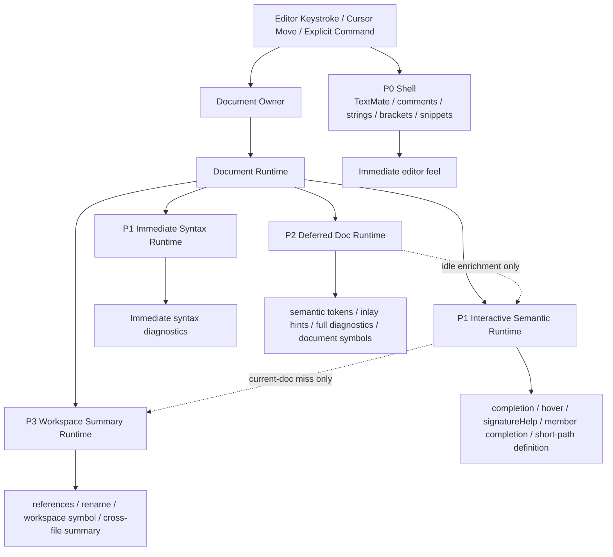

# 实时反馈优先架构路线图与里程碑提案

本文档定义本项目面向“编辑态即时反馈”的目标架构、实施里程碑、验收规范与性能测试要求。

重要说明：

- 本文档是提案，不是当前事实。
- 本文档位于 `docs/human-ai/`，属于人类与 AI 协作设计稿区域。
- 当前事实仍以 `README.md`、`docs/architecture.md`、`docs/resources.md`、`docs/testing.md` 为准。
- 本文档不再承担“记录当前进度”的职责，只定义目标状态、阶段边界和退出标准，避免随着实现推进而迅速过期。
- 每个里程碑只有在“功能验收 + 性能验收 + 文档同步”都完成后，才算真正结束。

## 1. 为什么要重写本文档

旧版提案存在四个问题：

1. 把目标架构、阶段性实现和未来设想写在同一层，读者容易把提案误当成当前事实。
2. 里程碑更像主题集合，不够像可以直接拆任务、开 PR、做验收的交付阶段。
3. 每个阶段缺少明确退出标准，导致“差不多完成”和“已经达到设计要求”之间没有边界。
4. 性能目标写得很强，但没有对应的性能测试用例、采样方法和门禁方式，最终只能靠主观体感讨论。

重写后的文档目标是：

- 先明确最终要到达什么状态。
- 再把路线拆成按风险递进的里程碑。
- 每个里程碑都绑定功能验收规范。
- 每个里程碑都绑定性能测试用例和通过阈值。

## 2. 最终目标与设计边界

### 2.1 最终目标

如果压缩成一句话，本方案要把本项目从“功能可用的 LSP”推进成“编辑优先、current-doc first、对连续输入稳定友好的 LSP”。

用户在编辑时应感知到的改善：

- 输入 `//`、`/*`、字符串引号、括号时，基础视觉反馈立即稳定。
- 输入变量、函数、方法调用时，`completion`、`signatureHelp`、`hover`、成员补全明显更跟手。
- 缺少 `;`、括号未闭合、块注释未闭合、预处理配对错误能更早暴露。
- 对本应以 `;` 结束的单行语句，删除 `;` 或处于缺失 `;` 状态时，应在语句末尾附近尽快出现红色波浪线，而不是主要依赖 full diagnostics 事后补齐。
- `semantic tokens`、`inlay hints`、full diagnostics、workspace summary 仍然存在，但不会反向拖慢编辑热路径。

### 2.2 非目标

当前路线图不把下面这些事情作为优先目标：

- 先把所有跨文件能力做到最完整
- 先把 `rename` / `references` / `workspace symbol` 做到最强
- 先重写一个覆盖所有语法细节的完整编译器前端
- 为了“更抽象”而引入额外层次、额外线程、额外 cache
- 缓存某次 hover markdown、某次 completion 列表、某次 diagnostics 数组这类瞬时 UI 结果

### 2.3 目标响应预算

下面的预算是里程碑最终要收敛到的 UX 目标，优先看 `p95`，不是协议 SLA。

| 层次 | 典型能力 | 目标响应时间 | 备注 |
| --- | --- | --- | --- |
| `P0 Shell` | 注释、字符串、括号、基础编辑行为 | 主观上接近 `0-16ms` | 不依赖 server |
| `P1 Interactive` | completion、signature help、hover、member completion、当前文档短路径 definition | `50-120ms` | 编辑体验核心 |
| `P1 Syntax` | 即时语法 diagnostics | `60-100ms` | 必须先于 full diagnostics |
| `P2 DeferredDoc` | semantic tokens、inlay hints、full diagnostics、document symbols | `150-1200ms` | 允许慢，但不能阻塞输入 |
| `P3 Workspace` | references、rename、workspace symbol、workspace summary | `300ms+` | 不属于逐键热路径 |

### 2.4 设计原则

最终架构必须长期满足这些原则：

- `current-doc first`
  - 热路径优先回答当前文档问题，只有 miss 时才向更重层级查询。
- `interactive first`
  - 变量、函数、方法调用相关能力优先级高于 deferred 和 workspace。
- `background isolation`
  - 后台任务必须 latest-only、可取消、不能拖慢前台交互。
- `cache as runtime`
  - cache 缓存的是中间语义事实，不是最终 UI 结果。
- `single-owner per document`
  - 打开的每个文档都必须有明确 owner 和统一的 snapshot 切换点。
- `no hidden hot-path fallback`
  - 没有经过文档声明的热路径重扫描、include graph 直扫或工作区现算，不应悄悄回到主查询链路里。

## 3. 目标架构总图

### 3.1 分层模型

### 3.2 关键运行时契约

#### `AnalysisSnapshotKey`

`AnalysisSnapshotKey` 是 current-doc 分析上下文的不可变键，至少应覆盖：

- `documentUri`
- `documentVersion`
- `documentEpoch`
- `activeUnitPath`
- `definesFingerprint`
- `includePathsFingerprint`
- `shaderExtensionsFingerprint`
- `resourceModelHash`
- `workspaceSummaryVersion`

要求：

- `Interactive Cache` 与 `Deferred Doc Cache` 必须围绕同一份 key 管理。
- stale snapshot 只允许在 stable context 不变时被有限复用。

#### `ActiveUnitSnapshot`

`ActiveUnitSnapshot` 负责封装 interactive 和 deferred 共享的分析前提：

- active unit
- include closure
- active branch context
- preprocessor macro state
- workspace summary version

要求：

- 调用方不能各自重建一套 include / macro / active branch 上下文。
- active unit / defines / include closure 变化必须驱动 analysis key 变化。

#### `Document Runtime`

`Document Runtime` 是 current-doc 状态统一容器，至少承载：

- `text / version / epoch`
- `changed ranges`
- `ImmediateSyntaxSnapshot`
- `InteractiveSnapshot`
- `lastGoodInteractiveSnapshot`
- `DeferredDocSnapshot`

要求：

- `didOpen`、`didChange`、active unit 变化、defines 变化、workspace summary 变化先进入 owner，再切换 snapshot。
- 查询线程只读取已完成 snapshot，不直接写共享状态。

### 3.3 统一查询顺序

交互能力统一按以下顺序查询：

1. 当前输入版本的 `Interactive Cache`
2. 当前文档的 `last good interactive snapshot`
3. 当前文档的 `Deferred Doc Cache`
4. `Workspace Summary Cache`
5. 文档明确允许的最慢兜底

适用能力：

- `completion`
- `signature help`
- `hover`
- `member completion`
- `method hover`
- 当前文档短路径 `definition`

### 3.4 stale 结果使用契约

| 功能 | 是否允许 stale | 允许条件 | 不允许条件 |
| --- | --- | --- | --- |
| completion | 允许有限 stale | 同一 stable context、仍在同一函数/作用域 | active unit / defines 已变化 |
| signature help | 允许有限 stale | 同一调用点、参数位次仍可识别 | 调用名已变化、括号结构失配 |
| hover | 允许有限 stale | 同一符号附近、stable context 不变 | 光标跨符号、active unit 已变化 |
| member completion | 允许有限 stale | `base` 仍可识别、同一函数内 | `base` 类型不稳定或调用链变化 |
| 当前文档短路径 definition | 允许有限 stale | 同一文档、同一局部符号 | 已进入跨文件或 include context 已变化 |
| 即时语法 diagnostics | 不允许 stale publish | 无 | 所有 stale 结果都必须丢弃 |
| semantic tokens / inlay / full diagnostics | 不允许 stale final result | 无 | 所有过期后台任务都必须 drop |
| references / rename | 不允许 stale final answer | 无 | 必须基于最新 summary 与当前文档状态 |

## 4. 统一验收与性能测试框架

本节定义所有里程碑共用的退出规则。后续里程碑只补充本阶段专属用例和阈值。

### 4.1 功能验收统一规则

每个里程碑结束时，至少要满足：

1. 本阶段范围内的实现已经落地，且模块边界和查询顺序有明确文档。
2. 对应 repo 模式集成测试已覆盖正例、反例和退化场景。
3. 当前事实文档与提案文档边界清晰，没有把“未来目标”误写成“当前事实”。
4. 本阶段明确禁止的 fallback、兼容层或双路径没有被重新引入。
5. 提交物中包含可复现的性能测试结果，而不是只给主观结论。

### 4.2 性能测试统一规则

除非某个里程碑另有说明，性能测试统一按下面的方法执行：

- 先构建 C++ server：`cmake --build .\\server_cpp\\build`
- 交互行为验证以 repo 模式夹具为主：`npm run test:client:repo`
- warm 测试前等待 workspace indexing 进入 `Idle`
- 每个场景至少采样：
  - cold：10 次
  - warm：30 次
- 同时记录：
  - 端到端 wall-clock
  - `nsf/metrics` 暴露的 p50/p95/p99
  - cancellation / stale drop / latest-only merge
  - snapshot wait / merge hit / merge miss
- 每个场景至少在两种负载下运行：
  - `Idle`
  - 一个适用的 load 模式：`Load-BG` 或 `Load-WS`

### 4.3 统一负载模型

| 负载名 | 含义 | 用途 |
| --- | --- | --- |
| `Idle` | 无额外后台压力，只保留正常 indexing | 测量基线 |
| `Load-BG` | 持续触发 semantic tokens / inlay / document symbols / full diagnostics | 验证前后台隔离 |
| `Load-WS` | 人工触发 file watch、workspace summary 刷新、include 回流 | 验证 cross-file 回流与交互隔离 |

### 4.4 统一夹具分层

建议在后续阶段补齐专用 perf 夹具，并固定在仓库内，避免性能讨论依赖外部工作区。

| 夹具 ID | 目标场景 | 建议规模 |
| --- | --- | --- |
| `PFX-1 SmallCurrentDoc` | 单文件 current-doc 交互 | `200-300` 行、无复杂 include |
| `PFX-2 MediumEditPath` | 典型编辑热路径 | `600-1000` 行、`3-8` 个 include |
| `PFX-3 LargeCurrentDoc` | 长文件与连续编辑 | `1500+` 行、深一点的局部作用域 |
| `PFX-4 ActiveUnitAmbiguous` | active unit / include-context / define 切换 | 多 root unit、同名候选 |
| `PFX-5 ReverseIncludeImpact` | file watch / reverse include 回流 | 多 include consumer、多个打开文档 |

建议新增的性能测试入口：

- `src/test/perf/interactive.perf.ts`
- `src/test/perf/diagnostics.perf.ts`
- `src/test/perf/deferred-doc.perf.ts`
- `src/test/perf/workspace.perf.ts`

这些文件名是未来建议，不属于当前事实。

### 4.5 里程碑退出产物

每个里程碑在关闭前必须产出：

1. 功能改动说明
2. 对应测试 suite / 用例列表
3. cold / warm / load 三组性能报告
4. 当前事实文档是否需要同步更新的结论
5. 已知未完成项列表

## 5. 里程碑路线图

下面的里程碑按推荐顺序排列。每个里程碑都应尽量做到“单次发版可控、失败可回退、验收边界清楚”。

### M0. 基线、观测与性能夹具

#### 目标

在继续重构前，先把“怎么量、量什么、在哪些夹具上量”固定下来，避免后续所有阶段都停留在主观体感讨论。

#### 范围

- 明确 interactive / deferred / workspace 的核心指标定义
- 固定 repo 模式性能夹具
- 建立统一性能测试入口和输出格式
- 让 `nsf/metrics` 能稳定支撑 milestone 验收

#### 不在本阶段解决

- 不追求此阶段就把交互延迟压到最终目标
- 不重构主要运行时模块
- 不改变公开行为，只补齐观测和基线

#### 验收规范

1. 已有 repo 集成 suite 继续全部通过。
2. 至少有一条自动化路径能够同时采集 wall-clock 和 `nsf/metrics`。
3. interactive / deferred / workspace 三类请求都能产出统一格式报告。
4. 同一夹具在连续 3 次 warm rerun 中，核心指标波动不超过 `10%`。
5. 所有后续里程碑引用的 `PFX-*` 夹具已经落盘并可复用。

#### 性能测试用例

| 用例 ID | 场景 | 夹具 | 负载 | 通过标准 |
| --- | --- | --- | --- | --- |
| `M0-P1` | 采集 completion / hover / signatureHelp 的 cold 与 warm 基线 | `PFX-1`、`PFX-2` | `Idle` | 报告完整，无缺失指标 |
| `M0-P2` | 采集 semantic tokens / inlay / full diagnostics 的基线 | `PFX-2`、`PFX-3` | `Idle` | 报告完整，无缺失指标 |
| `M0-P3` | 在后台负载下采集 interactive 指标 | `PFX-2` | `Load-BG` | latest-only / cancellation / snapshot wait 指标可见 |
| `M0-P4` | 在 file watch / reverse include 场景下采集回流指标 | `PFX-5` | `Load-WS` | workspace 回流与 interactive 指标可同时采集 |

### M1. 调度分层与前后台隔离

#### 目标

把“谁能阻塞谁”变成显式契约，确保 interactive 与 syntax 路径优先级长期高于 deferred / workspace。

#### 范围

- 明确请求优先级分层
- 明确 latest-only 与 cancellation 覆盖范围
- 消除热路径中未声明的 workspace scan / include graph 直扫兜底
- 固化 interactive、syntax、background 的调度边界

#### 验收规范

1. `completion`、`hover`、`signatureHelp`、当前文档短路径 `definition` 明确属于 interactive 高优先级路径。
2. `semantic tokens`、`inlay hints`、`document symbols`、`references`、`rename`、`workspace symbol` 明确属于 latest-only 的后台路径。
3. 即时语法 diagnostics 的发布时间不能被后台请求排队拖慢。
4. 热路径 miss 时允许查询 workspace summary，但不能重新回到 include graph 直扫或临时全工作区重扫。
5. 本阶段结束后，调度契约必须能在头文件说明或提案文档中被 reviewer 直接读到，而不是只能从实现猜。

#### 性能测试用例

| 用例 ID | 场景 | 夹具 | 负载 | 通过标准 |
| --- | --- | --- | --- | --- |
| `M1-P1` | 持续触发 semantic tokens / inlay / document symbols 时测 completion | `PFX-2` | `Load-BG` | completion `p95 <= 100ms`，且相对 `Idle` 退化不超过 `15%` |
| `M1-P2` | file watch / workspace summary 刷新期间测 hover | `PFX-4`、`PFX-5` | `Load-WS` | hover `p95 <= 120ms` |
| `M1-P3` | 背景 latest-only 压测 | `PFX-2` | `Load-BG` | 被新请求覆盖的后台任务 drop 比例 `>= 90%` |
| `M1-P4` | 连续快速输入期间测 interactive 稳定性 | `PFX-2` | `Load-BG` | 不出现 stale final result publish |

### M2. Immediate Syntax Runtime

#### 目标

把即时语法反馈从“轻量 diagnostics 的一部分”推进成真正稳定的 changed-window 快路径。

#### 范围

- changed-range 驱动的 immediate syntax snapshot
- 快速发布缺分号、括号未闭合、块注释未闭合、预处理配对错误
- stale fast diagnostics 丢弃策略
- fast / full diagnostics 的发布顺序契约

#### 验收规范

1. `didChange` 后，immediate syntax diagnostics 先于 full diagnostics 发布。
2. 缺分号、括号未闭合、块注释未闭合、预处理配对至少有稳定正反例覆盖。
3. 对高置信的单行缺分号场景，诊断应优先由 immediate syntax 发布，并把红色波浪线落在语句末尾附近；不能把这类反馈主要留给 full diagnostics 补报。
4. 连续输入时不会发布过期版本的 fast diagnostics。
5. changed-window 逻辑对单行、小范围编辑有效，且不会默认整份文档重扫。
6. `client.diagnostics.test.ts` 或其拆分 suite 中有独立用例验证 fast/full 分层，以及“编辑时删除 `;` 后即时出现缺分号波浪线”的场景。

#### 性能测试用例

| 用例 ID | 场景 | 夹具 | 负载 | 通过标准 |
| --- | --- | --- | --- | --- |
| `M2-P1` | 删除 `;` 后等待即时错误出现 | `PFX-1`、`PFX-2` | `Idle` | immediate syntax diagnostics `p95 <= 100ms` |
| `M2-P2` | 输入 `/*` 或删除 `)` 触发未闭合错误 | `PFX-1`、`PFX-2` | `Idle` | immediate syntax diagnostics `p95 <= 100ms` |
| `M2-P3` | 后台 full diagnostics 持续运行时测即时语法 | `PFX-2` | `Load-BG` | 与 `Idle` 相比退化不超过 `20ms` |
| `M2-P4` | 连续 20 次快速编辑只保留最新 fast 结果 | `PFX-2` | `Load-BG` | 不发布 stale fast diagnostics |

### M3. Current-Doc Interactive Runtime

#### 目标

让变量、函数、方法调用相关能力真正以 current-doc runtime 为主引擎，而不是把通用语义快照包装成“看起来像 interactive”。

#### 范围

- current-doc locals / params / top-level functions / globals / structs 的查询优先级
- callsite / overload / member access 的稳定查询底座
- `last good interactive snapshot` 的显式契约
- interactive 与 deferred / workspace 的 merge 优先级

#### 验收规范

1. `completion` 对 locals / params / current-doc top-level 的优先级高于 workspace summary。
2. `signatureHelp` 优先命中 current-doc overload，而不是先走 workspace summary。
3. `hover`、`member completion`、当前文档短路径 `definition` 按“current -> last-good -> deferred -> workspace”的顺序工作。
4. `last good interactive snapshot` 只能在 stable context 不变时使用，越界条件有文档说明和测试。
5. 当 current-doc 已命中时，workspace summary 不能覆盖其主结果，只能补强。
6. `client.interactive-runtime.test.ts` 对 locals、params、member access、signature help、short-path definition 有明确断言。

#### 性能测试用例

| 用例 ID | 场景 | 夹具 | 负载 | 通过标准 |
| --- | --- | --- | --- | --- |
| `M3-P1` | 输入 `obj.` 触发成员补全 | `PFX-1`、`PFX-2` | `Idle` | member completion `p95 <= 80ms` |
| `M3-P2` | 输入 `foo(` / `,` 触发 signature help | `PFX-1`、`PFX-2` | `Idle` | signature help `p95 <= 80ms` |
| `M3-P3` | hover 当前局部变量 / 参数 / 成员访问 base | `PFX-2`、`PFX-3` | `Idle` | hover `p95 <= 100ms` |
| `M3-P4` | 当前文档短路径 definition | `PFX-2` | `Idle` | definition `p95 <= 120ms` |
| `M3-P5` | 连续输入下复用 current 或 last-good snapshot | `PFX-2`、`PFX-3` | `Load-BG` | warm 场景 `noSnapshotAvailable == 0`，interactive `p95` 相对 `Idle` 退化不超过 `15%` |

### M4. Analysis Context 统一与 Deferred Doc Runtime 收编

#### 目标

让 interactive、deferred、active unit、preprocessor context 都围绕统一分析前提工作，避免不同能力各自拼一套上下文。

#### 范围

- `AnalysisSnapshotKey` 完整落地
- `ActiveUnitSnapshot` 统一 interactive 与 deferred 的分析前提
- `Deferred Doc Runtime` 收编 semantic snapshot / AST / semantic tokens / inlay / full diagnostics / document symbols
- active branch / include closure / define 变化的统一失效传播

#### 验收规范

1. active unit、include closure、defines、workspace summary version、resource model 变化会驱动统一的 analysis key 失效。
2. interactive snapshot 与 deferred snapshot 共享相同的上下文前提，不再各自隐式重建 include / macro / active branch 语境。
3. `semantic tokens`、`inlay hints`、full diagnostics、`document symbols` 通过 deferred doc runtime 产出和复用。
4. active preprocessor branch 对 hover / definition / 局部类型相关能力的影响有稳定断言。
5. 只有文档明确声明的例外才能保留 legacy 文本补强，其他能力不得再依赖旧扫描链路。

#### 性能测试用例

| 用例 ID | 场景 | 夹具 | 负载 | 通过标准 |
| --- | --- | --- | --- | --- |
| `M4-P1` | active unit 切换后重新请求 hover / completion | `PFX-4` | `Idle` | 首个有效 interactive 结果 `p95 <= 250ms` |
| `M4-P2` | semantic tokens full | `PFX-2`、`PFX-3` | `Idle` | `PFX-2` 上 `p95 <= 400ms`；`PFX-3` 上 `p95 <= 700ms` |
| `M4-P3` | full-document inlay hints | `PFX-2`、`PFX-3` | `Idle` | `PFX-2` 上 `p95 <= 500ms`；`PFX-3` 上 `p95 <= 800ms` |
| `M4-P4` | full diagnostics 在编辑后补齐 | `PFX-2`、`PFX-3` | `Load-BG` | `PFX-2` 上 `p95 <= 1200ms`；`PFX-3` 上 `p95 <= 1800ms` |
| `M4-P5` | deferred 构建期间测 interactive 退化 | `PFX-2` | `Load-BG` | completion / hover / signatureHelp 的 `p95` 退化不超过 `15%` |

### M5. Workspace Summary、回流链路与跨文件稳定性

#### 目标

把跨文件能力明确压到 workspace summary 边界内，同时保证 include 回流、候选 unit、references / rename 的正确性和稳定性。

#### 范围

- `workspace_summary_runtime.*` 与 `workspace_index.*` 的边界收敛
- reverse include closure 回流
- include-context ambiguous 的一致行为
- references / rename / workspace symbol 的 latest-only 与 summary-first 契约

#### 验收规范

1. `references` / `rename` / `workspace symbol` 依赖 workspace summary，而不是重新回到 include graph 热路径现算。
2. include-context ambiguous 的 hover、definition、references、rename 行为有统一契约和稳定断言。
3. file watch 只刷新直接变更或 reverse-include 命中的相关文档，不整批脏化所有 open docs。
4. workspace summary version 变化只回流真正受影响的 current-doc runtime。
5. 本阶段结束后，cross-file correctness 与 interactive isolation 两类测试都要能稳定通过。

#### 性能测试用例

| 用例 ID | 场景 | 夹具 | 负载 | 通过标准 |
| --- | --- | --- | --- | --- |
| `M5-P1` | include provider 文件保存后 consumer 文档回流 | `PFX-5` | `Load-WS` | 受影响文档拿到更新结果 `p95 <= 1500ms` |
| `M5-P2` | references | `PFX-5` | `Idle` | references `p95 <= 500ms` |
| `M5-P3` | prepareRename + rename | `PFX-5` | `Idle` | prepareRename `p95 <= 250ms`；rename final `p95 <= 800ms` |
| `M5-P4` | indexing / file watch 压力下测 completion | `PFX-5` | `Load-WS` | completion `p95` 相对 `Idle` 退化不超过 `20%` |
| `M5-P5` | include-context ambiguous 查询一致性 | `PFX-4` | `Idle` | hover / definition / references / rename 行为全部符合契约，无随机漂移 |

## 6. 里程碑与测试入口映射

本节不是当前事实，而是推荐的测试编排方式，方便后续任务拆分。

| 里程碑 | 主要功能验收入口 | 主要性能验收入口 |
| --- | --- | --- |
| `M0` | 现有 repo suites smoke + 新增 perf harness smoke | `interactive.perf`、`diagnostics.perf`、`deferred-doc.perf`、`workspace.perf` |
| `M1` | `client.interactive-runtime.test.ts`、`client.deferred-doc-runtime.test.ts`、`client.workspace-summary.test.ts` | `interactive.perf` |
| `M2` | `client.diagnostics.test.ts` | `diagnostics.perf` |
| `M3` | `client.interactive-runtime.test.ts` | `interactive.perf` |
| `M4` | `client.deferred-doc-runtime.test.ts`、相关 interactive suite | `deferred-doc.perf`、`interactive.perf` |
| `M5` | `client.workspace-summary.test.ts`、`client.references-rename.test.ts` | `workspace.perf`、`interactive.perf` |

## 7. 文档维护规则

为了避免本文再次失真，后续维护应遵守：

1. 本文只更新目标架构、里程碑边界、验收与性能标准，不写“当前已完成百分比”。
2. 当前事实变化时，优先更新 `README.md`、`docs/architecture.md`、`docs/testing.md`，不要反过来拿本文代替事实文档。
3. 某个里程碑如果改了公开行为、验证命令、测试入口或关键模块边界，必须在同一次任务中同步更新对应事实文档。
4. 某个性能阈值如果长期不合理，应在同一次任务里连同夹具、指标解释和里程碑影响一起更新，不能只改单个数字。

## 8. 结束定义

只有当下面四件事同时成立时，才可以宣称“实时反馈优先架构基本达标”：

1. `M0-M5` 的功能验收全部通过。
2. `M0-M5` 的性能测试全部达到各自阈值。
3. 当前事实文档与本提案之间不存在已知冲突。
4. 新增需求不会再迫使热路径偷偷回退到重扫描、重兜底或隐式并发共享状态。
